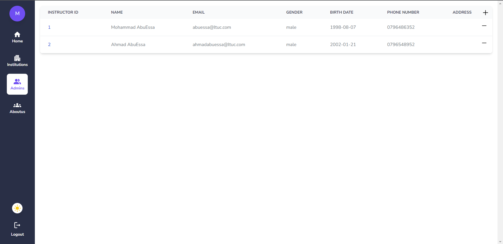

# LMS

## Backend Repository
Link: <https://github.com/LM-System/frontend>

## Frontend Images
Here are some images showcasing our project:

This is a [Next.js](https://nextjs.org/) project bootstrapped with [`create-next-app`](https://github.com/vercel/next.js/tree/canary/packages/create-next-app).

